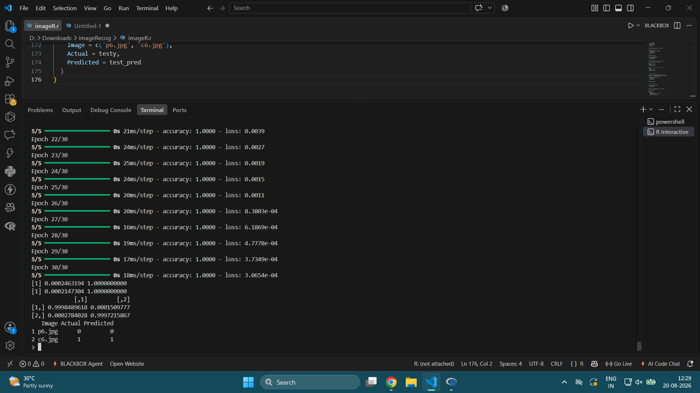

# Image Recognition and Classification with R

## Objective

The objective of this project is to implement an image recognition and classification system using R Programming. The project demonstrates image loading, preprocessing, reshaping, dataset preparation, neural network construction, model training, evaluation, and prediction using R.

## Problem Description

The project classifies images into two categories using a neural network implemented with Keras in R. A small image dataset is used for training and testing the classification model.

## Dataset

The project uses 12 image files:

- `p1.jpg` to `p6.jpg` – Class 0
- `c1.jpg` to `c6.jpg` – Class 1

Five images from each class are used for training, while one image from each class is used for testing.

### Dataset Split

| Dataset | Class 0 | Class 1 | Total |
|---|---:|---:|---:|
| Training | 5 images | 5 images | 10 images |
| Testing | 1 image | 1 image | 2 images |
| Total | 6 images | 6 images | 12 images |

## Libraries Used

- **EBImage** – Used for reading, processing, resizing, displaying, and exploring images.
- **Keras** – Used to build and train the neural network model.
- **Reticulate** – Used to work with NumPy arrays for model training and evaluation.

## Implementation

The following major steps were performed:

1. Loaded the required R packages.
2. Read the image files using EBImage.
3. Explored the images using display, summary, histogram, and structure functions.
4. Resized all images to `28 × 28`.
5. Reshaped the images into feature vectors.
6. Created training and testing datasets.
7. Applied one-hot encoding to the class labels.
8. Built a sequential neural network using Keras.
9. Used two hidden dense layers with ReLU activation.
10. Used a two-unit softmax output layer for classification.
11. Compiled the model using categorical cross-entropy loss and RMSprop optimizer.
12. Trained the model for 30 epochs with a batch size of 2.
13. Evaluated the model on the training data.
14. Generated class probabilities and predictions.
15. Evaluated the model on the test images.
16. Compared the actual and predicted classes.

## Image Preprocessing

Each input image was resized to `28 × 28`.

The processed image data was reshaped into a feature vector containing `2352` features. These feature vectors were then used as input to the neural network.

## Neural Network Architecture

```text
Input Layer: 2352 features
        ↓
Dense Layer: 256 neurons, ReLU
        ↓
Dense Layer: 128 neurons, ReLU
        ↓
Output Layer: 2 neurons, Softmax
```

## Model Configuration

| Parameter | Value |
|---|---|
| Input Features | 2352 |
| Hidden Layer 1 | 256 neurons |
| Hidden Layer 2 | 128 neurons |
| Output Layer | 2 neurons |
| Hidden Activation | ReLU |
| Output Activation | Softmax |
| Loss Function | Categorical Cross-Entropy |
| Optimizer | RMSprop |
| Metric | Accuracy |
| Epochs | 30 |
| Batch Size | 2 |

## Training

The neural network was trained using the prepared training dataset for **30 epochs** with a **batch size of 2**.

The model used RMSprop as the optimizer, categorical cross-entropy as the loss function, and accuracy as the evaluation metric.

## Model Evaluation

After training, the model was evaluated using the training data. Prediction probabilities were generated and converted into class predictions using the class with the highest probability.

A confusion table was also generated to compare predicted classes with actual classes.

## Test Results

The trained model was evaluated on two test images:

| Image | Actual Class | Predicted Class | Result |
|---|---:|---:|---|
| `p6.jpg` | 0 | 0 | Correct |
| `c6.jpg` | 1 | 1 | Correct |

Both test images were correctly classified in the demonstrated execution.

## Output

The successful execution output is available in `output.png`.

The output demonstrates model training, evaluation, prediction probabilities, and final test predictions.

## Screenshot



## How to Run

1. Install R and RStudio.
2. Install the required R packages.
3. Install and configure the required Python/Keras environment if necessary.
4. Place the image files in the appropriate project directory.
5. Open `imageRecogClass.R` in RStudio.
6. Update the image directory path according to your system.
7. Run the R script.
8. Observe the model training, evaluation, and prediction results.

## Project Structure

```text
Image-Recognition-R/
│
├── imageRecogClass.R
├── README.md
└── output.png
```

## Results Summary

The project successfully implemented an image recognition and classification system using R, EBImage, Keras, and Reticulate.

The images were loaded and explored, resized to `28 × 28`, reshaped into feature vectors, and divided into training and testing datasets. A neural network consisting of two hidden dense layers and a softmax output layer was trained for 30 epochs.

The final test execution correctly classified both test images:

- `p6.jpg` → Class 0
- `c6.jpg` → Class 1

## Conclusion

The project demonstrates an end-to-end image recognition and classification workflow using R Programming. It covers image preprocessing, dataset preparation, neural network implementation, model training, evaluation, and prediction.

The successful classification of both test images demonstrates that the implemented model performed the intended classification task on the provided test samples.
